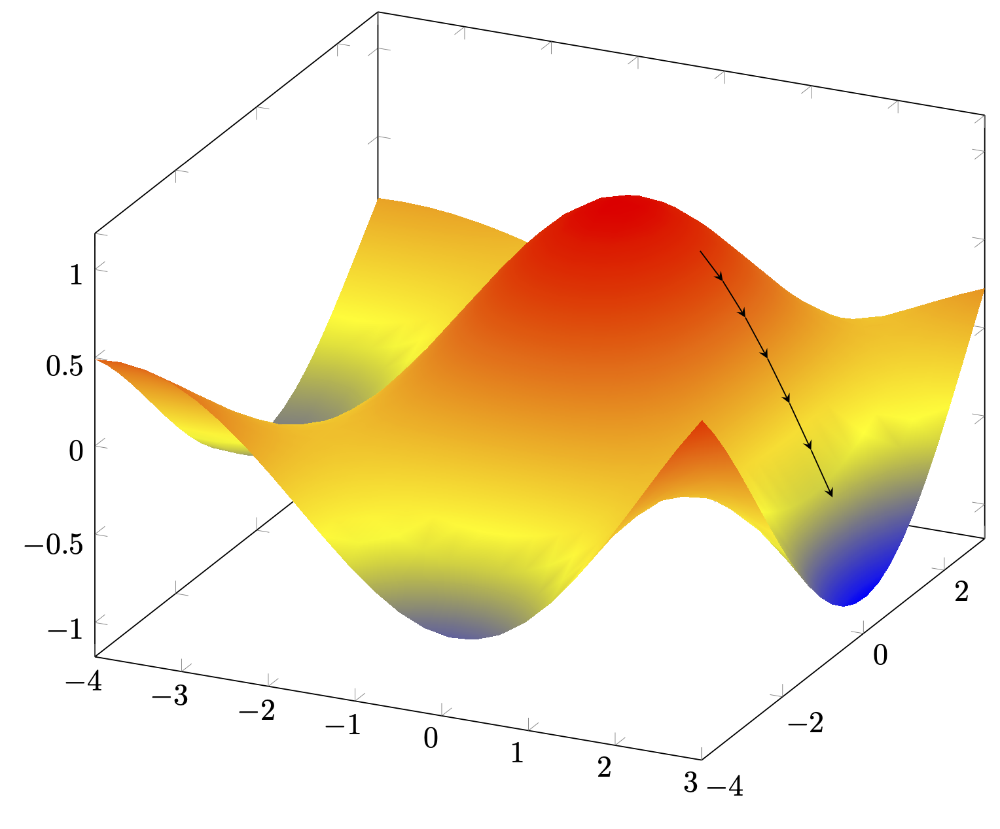

# Linear Regression

A regression model is a statistical technique used to understand and quantify the relationship between a dependent variable and one or more independent variables. In other words, it aims to predict the value of a dependent variable based on the values of one or more independent variables.

In a regression model, the hypothesis is expressed mathematically as the relationship between the independent variables and the dependent variable. The goal is to find the best-fitting function that describes this relationship. For a simple linear regression model, the hypothesis can be expressed as:

$$
Y_{predicted} = \beta_{0} + \beta_{1}X + \varepsilon
$$

The above equation, in layman (noob) terms can be expressed as:

$$
y = c + mx + e
$$

**Where:**

- $Y$ = Dependent Variable (the variable being predicted or explained)
- $X$ = Independent Variable (the variable used to predict or explain ($Y$))
- $\beta_{0}$ = Intercept Term (point on Y-axis where the regression line intersects (similar to $c$ in $y=mx+c$))
- $\beta_{1}$ = Slope Coefficient (representing the change in $Y$ for a one-unit change in ($X$))
- $\varepsilon$ = Error Value (representing the difference between the observed value and the value predicted by the model)
- $n$ = Number of Different Input Features
- $N$ = Number of Training Points
- $i$ = A Number in Range of 1 to $N$
- $q$ = A Number in Range of 0 to $n$
- $(X, Y)$ = All Training Points
- $(X^{i}, Y^{i})$ = One Training Point (among $N$ points)

The goal of regression analysis is to estimate the values of the coefficients ($\beta_{0}$ and $\beta_{1}$) that best fit the observed data. Once these coefficients are estimated, the regression model can be used to make predictions about the dependent variable $Y$ for new values of $X$.

For a linear regression models with more than one independent variable, the hypothesis can be extended as follows:

$$
h_{\beta}(X) = Y_{predicted} = \beta_{0} + \beta_{1}X_{1} + \beta_{2}X_{2} + \cdots + \beta_{n}X_{n} + \varepsilon
$$

$$
h_{\beta}(X) = Y_{predicted} = \sum_{q = 0} ^ {n} \beta_{q}X_{q} + \varepsilon \quad \text{where} \ X_{0} = 1 \ \text{and} \ q \in \ (0, 1, 2, \ldots, n)
$$

The slope coefficient $\beta$ and independent variable (input $X$) are $n+1$ dimensional vectors represented as follows:

$$
\begin{equation}
X =
\begin{bmatrix}
X_{0} \\
X_{1} \\
X{2} \\
\vdots \\
X_{n} \\
\end{bmatrix}
\quad
and \quad
\beta =
\begin{bmatrix}
\beta_{0} \\
\beta_{1} \\
\beta_{2} \\
\vdots \\
\beta_{n} \\
\end{bmatrix}
\end{equation}
$$

The values of $\beta$ must be chosen in such a way the prediction of the hypothesis must closely match to the observed values. Mathematically, it can be represented as:

$$
h_{\beta}(X) \simeq Y(X)
$$

Adding the error function, they become equal. It is mathematically expressed as:

$$
\begin{equation}
h_{\beta}(X) = Y(X) + \varepsilon = 
Y_{predicted}(X)
\end{equation}
$$

> **Note:** The error $\varepsilon$ can be a positive or negative quantity.
>

 **Where:**

- $h_{\beta}(X)$ = Hypothesis Function (with input as X and $\theta$ as the influencing parameter varying)
- $Y(X)$ = Observed Plot

## Error/Loss Function

In a regression model, an error or loss function, also known as a cost function, is a measure of how well the model's predictions match the actual observed values of the dependent variable. It quantifies the discrepancy between the predicted values generated by the regression model and the true values observed in the dataset.

The goal of a regression model is to minimize the error or loss function, as this indicates that the model's predictions are closer to the actual values. By minimizing the error function, the model learns to make more accurate predictions and better captures the underlying relationship between the independent and dependent variables.

## Types

There are various types of error or loss functions used in regression models, depending on the specific problem and the characteristics of the data. Some common examples include:

1. **Mean Squared Error (MSE)**: This is one of the most commonly used error functions in regression. It calculates the average of the squared differences between the predicted values and the true values. MSE penalizes larger errors more heavily than smaller errors.
2. **Mean Absolute Error (MAE)**: MAE calculates the average of the absolute differences between the predicted values and the true values. Unlike MSE, MAE does not square the errors, so it treats all errors equally regardless of their magnitude.
3. **Root Mean Squared Error (RMSE)**: RMSE is the square root of the MSE. It provides a measure of the average magnitude of the errors in the same units as the dependent variable. RMSE is useful for interpreting the error in a more intuitive manner.
4. **R-squared (R2) Score**: R-squared measures the proportion of the variance in the dependent variable that is explained by the independent variables. It ranges from 0 to 1, with higher values indicating a better fit of the model to the data. R-squared is not a direct measure of prediction error but is commonly used to evaluate the overall performance of a regression model.

Error or loss functions play a crucial role in training regression models. During the training process, the model adjusts its parameters to minimize the error function, thereby improving its predictive accuracy and capturing the underlying patterns in the data.

### Mean Square Error

Mean Squared Error (MSE) is commonly used as a loss function in regression models for several reasons. Firstly, MSE penalizes larger errors more heavily than smaller errors due to the squaring operation, making it sensitive to outliers and deviations from the true values.

Mathematically, it is represented as follows:

$$
\begin{equation}
J(\beta) = \varepsilon = \frac{1}{2N} \sum_{i = 1}^{N}
\left(
h_{\beta}(X^{i}) -
Y(X^{i})
\right)^{2}
\end{equation}
$$

> **Note:** Here, the average is multiplied by a factor of half so that it makes the calculation of gradient easier later in this chapter. It doesn't affect the optimization process as the scale of the loss function adjusts accordingly.
> 

The above method takes average of all the squared errors over the range of $N$.

## Algorithm to Reduce Loss Function: *Batch Gradient Descent*

Gradient Descent of a Single Feature Regression Model (z-axis representing error with x and y as the parameter β)

Gradient descent is an iterative optimization algorithm used to minimize a loss function and find the optimal parameters of a model. It is commonly used in machine learning and deep learning to update the parameters of a model in order to minimize the error between the predicted and actual values.

Mathematically, gradient descent is represented in terms of the parameters. The parameter assigns itself a value that produces less loss compared to the previous value.

$$
\begin{equation}
\beta_{q} := \beta_{q} - \alpha \frac{\partial J(\beta)}{\partial \beta_{q}} \quad \forall \ q \in [0, 1, 2, \ldots, n]
\end{equation}
$$

**Where:**

- $\frac{\partial J(\beta)}{\partial \beta_{q}}$ = Rate of Variation of Loss Function (with respect to the parameter $\beta_{q}$)
- $\alpha$ = Learning Rate (hyperparameter)

> **Note:** The partial derivative in the gradient descent function gives us the rate of change of the loss function with respect to a specific parameter (or parameters) of the model. Specifically, it tells us how the loss function would change if we were to make a small change in the value of that parameter, while holding all other parameters constant.
> 

> **Note:** The term "learning rate" refers to the rate at which a model learns from the training data. It determines the size of the steps taken during each iteration of optimization algorithms like gradient descent. The term "learning rate" is aptly named because it governs the speed at which a model learns from the training data. A higher learning rate means that the model updates its parameters more aggressively, taking larger steps towards the optimal solution. On the other hand, a lower learning rate means that the model updates its parameters more slowly, taking smaller steps towards the optimal solution. The learning rate is a key *hyperparameter* in machine learning models, and finding the right balance is crucial for effective learning. Too high of a learning rate can cause the model to overshoot the optimal solution or oscillate around it, while too low of a learning rate can cause the model to converge very slowly or get stuck in local minima.
> 

> **Note:** A partial derivative is a derivative of a multivariable function with respect to one of its variables, while holding all other variables constant. In other words, it measures how the function changes with respect to a specific variable while treating all other variables as constants. Here, the partial derivative is taken for one parameter in the $\beta$ vector $(1)$ while keeping the other parameters constant.
> 

> **Note:** The operator $:=$ is called the assignment operator. It is similar to $=$ (equal to) in programming, meaning that the value on the left is assigned to the value on the right.
> 

Considering the partial derivative from $(4)$ alone and substituting the loss function $J(\beta)$ in equation $(4)$, we get:

$$
\begin{equation}
\frac{\partial (J(\beta))}{\partial \beta_{q}} =
\frac{\partial \left(
\frac{1}{2N} \sum_{i = 0}^{N}
\left(
h_{\beta}(X^{i}) -
Y(X^{i})
\right)^{2}
\right)}
{\partial \beta_{q}}
\end{equation}
$$

To simplify the solving process, let’s consider that we have only one training data ($N = 1$). This eliminates the mean-square summation process.

$$
\begin{equation}
\frac{\partial (J(\beta))}{\partial \beta_{q}} =
\frac{\partial \left(
\frac{1}{2}
\left(
h_{\beta}(X) -
Y(X)
\right)^{2}
\right)}
{\partial \beta_{q}}
\end{equation}
$$

Differentiating the power alone, we get:

$$
\begin{equation}
\frac{\partial (J(\beta))}{\partial \beta_{q}} =
\frac{2}{2} \left(
h_{\beta}(X) -
Y(X)
\right)
\frac{\partial \left(
h_{\beta}(X) -
Y(X)
\right)}
{\partial \beta_{q}}
\end{equation}
$$

Expanding $h_{\beta}(X)$ inside the derivative, we get $\beta_{0} + \beta_{1}X_{1} + \beta_{2}X_{2} + \cdots + \beta_{n}X_{n} + \varepsilon$. Upon partially differentiating, the terms $\beta_{x}$ where $\ x \neq q$ becomes zero along with the constant terms. Hence, we’ll have only $X_{q}$ remaining where $q \in [0, 1, 2, \ldots, n]$.

$$
\begin{equation}
\frac{\partial (J(\beta))}{\partial \beta_{q}} =
\left(
h_{\beta}(X) -
Y(X)
\right)
\left(
X_{q}
\right)
\end{equation}
$$

Substituting this in $(4)$, we get:

$$
\begin{equation}
\beta_{q} := \beta_{q} - \alpha \left(h_{\beta}(X) - Y(X) \right)X_{q} \quad \forall \ q \in [0, 1, 2, \ldots, n]
\end{equation}
$$

> “To simplify the solving process, let’s consider that we have only one training data ($N = 1$). This eliminates the mean-square summation process.”
> 

We’ve used this to simplify the problem and calculated the gradient descent for only one training example. We now bring back the summation so that we can calculate the gradient descent for $N$ training examples.

> **Note:** Summation of derivatives and derivatives of sum are the same provided some conditions are met.
> 

Consider $(9)$:

$$
\begin{equation}
\beta_{q} := \beta_{q} - \alpha \sum_{i = 1}^{N} \left(h_{\beta}(X^{i}) - Y(X^{i}) \right)X_{q}^{i} \quad \forall \ q \in [0, 1, 2, \ldots, n]
\end{equation}
$$

### Disadvantage

As seen, the computation of batch gradient descent increases as the number of training examples increases as it has to calculate the loss plane for all value. Hence, for a very large dataset, this algorithm is computationally costly.

## Computationally Better Solution: Stochastic Gradient Descent

Stochastic Gradient Descent (SGD) is an optimization algorithm commonly used in machine learning to minimize the loss function during training. Unlike batch gradient descent, which computes the gradient of the loss function with respect to the parameters using the entire dataset, SGD updates the parameters using only *one training example at a time.*

The training examples are typically chosen randomly from the dataset. Each training example has an equal probability of being selected at each iteration. This randomness helps prevent the algorithm from getting stuck in local minima and allows it to explore different parts of the parameter space.

As the loss decreases, the learning rate is reduced gradually to reduce the size of the step taken. This ensures that the SGD reduces the size of its oscillation leading to the bouncing around a smaller region.

### Advantages

1. **Faster Convergence**: Since SGD updates the parameters more frequently (after processing each training example), it can converge faster, especially for large datasets.
2. **Better Generalization**: SGD introduces noise in parameter updates, which can help escape local minima and lead to better generalization performance.

### Disadvantages

1. **Noisy Updates**: Due to the randomness in selecting training examples, the updates in SGD can be noisy, leading to fluctuations in the optimization process.
2. **Learning Rate Tuning**: The learning rate in SGD needs to be carefully tuned. A too high learning rate can lead to oscillations or divergence, while a too low learning rate can slow down convergence.
3. **Not Suitable for Some Loss Functions**: SGD might not perform well with certain loss functions or in situations where the loss landscape is very rugged.

## One-step Approach to Find Global Minima

> **Note:** This approach works only with linear regression (with only one input parameter).
> 

### Definition: Calculating Derivative for a Matrix Function

Consider a function that maps a matrix to a real number. It can be represented mathematically as follows:

$$
f(x) : \mathbb{R}^{i \times j} \to \mathbb{R}
$$

For example, consider a function that maps a $2 \times 2$ matrix to a real number as follows:

$$
A =
\begin{bmatrix}
A_{11} & A_{12} \\
A_{21} & A_{22}
\end{bmatrix}
\quad \text{(let)}
$$

$$
f(A) : \mathbb{R}^{i \times j} \to \mathbb{R} = A_{11} + A_{12}^{2} \quad \text{(say)}
$$

Then, the partial derivative of the matrix can be derived as follows:

$$
\bigtriangledown_{A} f(A) =
\begin{bmatrix}
\frac{\partial f(A)}{\partial A_{11}} & \frac{\partial f(A)}{\partial A_{12}} \\
\frac{\partial f(A)}{\partial A_{21}} & \frac{\partial f(A)}{\partial A_{22}}
\end{bmatrix}
$$

$$
\bigtriangledown_{A} f(A) =
\begin{bmatrix}
1 & 2A_{12} \\
0 & 0
\end{bmatrix}
$$

Hence, the function is partially derived at each position with respect to the element at that position. Now that this is clear, we can proceed.

> **Note:** The slope (or derivative) at the maxima and minima points is zero because there is no more rise or fall in those regions to calculate slope for.
> 

### Definition: Trace of a Matrix

The trace of a matrix is the sum of all the diagonal elements of a matrix. It can be mathematically defined as follows:

$$
\text{tr} \ A = \sum_{i = 0}^{n} A_{ii} \quad  \text{where} \ n = \text{size of matrix}
$$

#### Properties of Trace Operation on Matrices

### The One-step Approach

To derive the one-step approach to find the global maxima, follow this video: [YouTube](https://youtu.be/4b4MUYve_U8?si=sz0qswNiWXND6YNB&t=3215). The final equation for finding the local minima can be expressed mathematically as:

$$
\beta = (X^{T}X)^{-1} X^{T}Y \\\\
X =
\begin{bmatrix}
-(X^{(0)})^{T}- \\
-(X^{(1)})^{T}- \\
-(X^{(2)})^{T}- \\
\vdots \\
-(X^{(N)})^{T}- \\
\end{bmatrix} \\
Y =
\begin{bmatrix}
Y^{0} \\
Y^{1} \\
Y^{2} \\
\vdots \\
Y^{N} \\
\end{bmatrix}
$$

Where:

$\beta$ = Parameter (a column vector as mentioned in $(1)$)

$X$ = Collection of Training Data Transposed (each row represents a set of features for one training example)

$Y$ = Collection of Observed Outputs (for $N$ training examples)

## Local Linear Regression

Local linear regression is a *non-parametric regression technique* used to estimate the relationship between a dependent variable and one or more independent variables. Unlike traditional linear regression, which assumes a global linear relationship between variables, local linear regression *fits a separate linear model to each data point,* considering only neighboring data points within a specified window or bandwidth.

Here's a basic outline of how local linear regression works:

1. For each data point in the dataset, define a window or bandwidth that determines the neighboring points to be considered.
2. Within this window, fit a weighted linear regression model using the neighboring data points, giving more weight to points closer to the target point.
3. Predict the value of the dependent variable for the target point based on the coefficients obtained from the linear regression model.
4. Repeat steps 2 and 3 for all data points in the dataset.

It is particularly useful in situations where the underlying relationship between variables is non-linear or exhibits heteroscedasticity (varying levels of variance across the data range).
